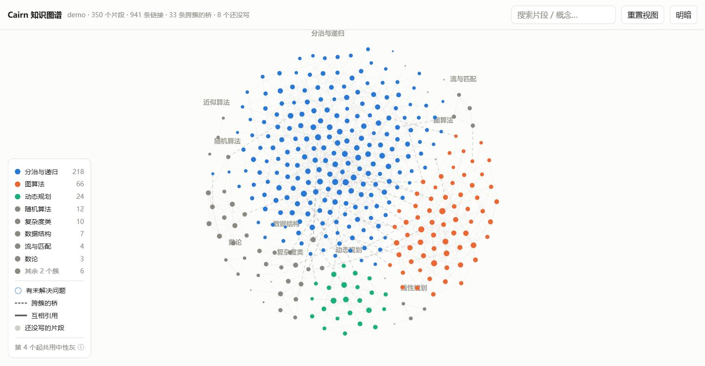
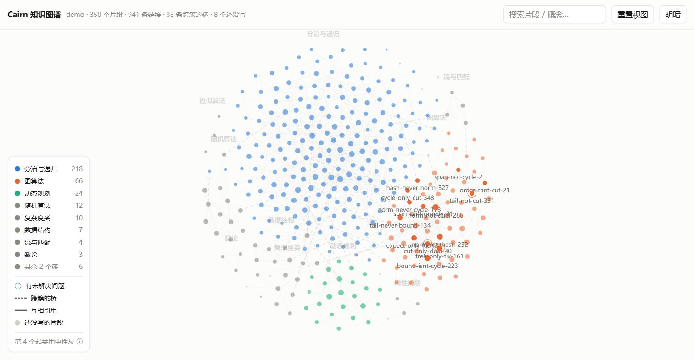

# Anamnesis

> 柏拉图的「回忆说」：学习不是获取新知，而是回忆灵魂本已知道的东西。

给 Claude Code 装一层**跨会话的学习记忆**。把你在对话里挣来的理解——卡在哪、
误解是什么、怎么想通的——在 `/compact` 抹掉它之前，存成可检索的片段。

*A cross-session memory layer for learning with Claude Code. It captures the
cognitive trail of a study session — misconceptions, breakthroughs, open
questions — into greppable fragments that get re-injected when you come back.
Docs and prompts are in Chinese.*

---

## 问题

用 agent 学数学物理或 CS 的时候，真正有价值的东西不是它给的正确答案——那些书上都有。
有价值的是**你卡在哪、为什么会那样想错、后来怎么绕过去的**。

而这部分只存在于对话里。上下文一满，`/compact` 一跑，它就没了。
下次开会话，你和 agent 都得从头再解释一遍同样的概念。

## 做了什么

三个机制，对应问题的三个环节：

```
      你和 agent 讨论
            │
    ┌───────┴────────┐
    │  触发          │  /cairn、模型主动提议、PreCompact 闹钟
    └───────┬────────┘
            ▼
    ┌────────────────┐
    │  归档          │  过质量闸门 → 你砍改 → 写片段 → 脚本重建索引
    └───────┬────────┘
            ▼
      cairn/  ← 跟着你的学习仓库走，能 commit
            │
    ┌───────┴────────┐
    │  检索          │  SessionStart 注入索引 → agent 按需展开片段全文
    └───────┬────────┘
            ▼
      下一个会话不用重新解释
```

**机制装在用户级（`~/.claude/`），数据长在项目级（每个学习仓库一个 `cairn/`）。**
一次安装，N 个学习仓库，各自的知识库跟着各自的仓库走。

不用 Claude Code 原生 memory，因为它在仓库外。学习经历要能变成一个能 commit、
能换机器、能分享的包，那就得跟着仓库走。

## 安装

```bash
git clone https://github.com/<you>/Anamnesis.git
cd Anamnesis
./install.sh
```

需要 `bash` 和 `python3`（脚本只用标准库）。安装会：

- 把 `src/skills/cairn/` 和 `src/hooks/cairn-*.sh` 拷进 `~/.claude/`
- 把三个 hook 合并进 `~/.claude/settings.json`（**先备份，不覆盖你已有的配置**）

## 用法

在任意学习仓库里开会话，打 `/cairn`。第一次它会问要不要初始化 `cairn/` 目录。

之后每次聊完一个主题就打一次。它会：

1. 回顾会话，过质量闸门筛选
2. **列提议表，一个文件都不写** —— 你在这里砍、改、补
3. 确认后落盘，跑脚本重建索引

下次开会话，`SessionStart` hook 自动把索引和所有未解决的问题注入上下文。

## 片段长什么样

````markdown
---
id: 2026-09-14-conformal-only-laplace
course: math-physics
concepts: [共形映射, conformal map, Laplace 方程, Helmholtz]
hook: 以为共形映射能简化任意二维 PDE，实际只对 Δu=0 有效
refs: [slides/Lecture 9.pdf, hw/hw03.md#p2]
status: open
---

## 触发
hw03 第二题把上半平面的 Dirichlet 问题映到单位圆盘。做完顺手想：
那 Helmholtz 方程也这么映一下，是不是也能化简？

## 卡点 / 误解
我一直把共形映射当成通用工具。不是。全部关键在 Δ(u∘f) = |f'|²·(Δu)∘f：
右边是原方程乘一个处处为正的标量因子，所以 Δu=0 保得住，
而 Δu+k²u=0 里 Δ 项带 |f'|²、k²u 项不带，常系数被逼成变系数，结构就破了。

## 关键 insight
同一个 |f'|² 还管着 Dirichlet 能量的共形不变性只在二维成立：
梯度贡献 |f'|²，体积元贡献 |f'|ⁿ，只有 n=2 时抵消。
这才是共形映射法是二维专属技术的根本原因。

## 遗留问题
- [ ] |f'|² 取什么形式时变系数 Helmholtz 还可解？
````

索引里它被压成一行——`hook` 字段就是破折号后那句：

```
- [conformal-only-laplace] 共形映射/conformal map/Laplace/Helmholtz — 以为共形映射能简化任意二维 PDE，实际只对 Δu=0 有效 | open:1 | 09-14
```

索引由 `rebuild_index.py` 从片段完全推导，不手写——手写迟早会漏条目，而漏掉的那条会
**静默地**从检索里消失：片段还在磁盘上，但再也没人找得到。

## 知识图谱



```bash
python ~/.claude/anamnesis/graph/graph.py cairn
```

生成 `cairn/graph.html`——**单文件、零外部依赖、离线可用**，浏览器直接打开。
和索引一样是从 `fragments/` 推导出来的，随时可重跑。

图能看出索引看不出的四件事：

- **哪些簇是孤岛** —— 一个簇和其他所有簇都不连，说明那块知识还没接进来
- **哪些簇之间只有一根线连着** —— 那根线通常就是理解刚打通的地方，画成虚线标为「桥」
- **哪些片段谁也不认识** —— 孤儿会被推到边缘
- **哪些片段你已经知道该写但还没写** —— 指向不存在片段的 `[[链接]]` 画成淡色幽灵节点

最后一条借自 Obsidian 的 unresolved 节点。死链在 cairn 里不是错误，是一个**意图**：
写下 `[[还没写的片段]]` 说明你已经知道那块该有东西。它和孤儿正好成对——
孤儿有内容没连接，幽灵有连接没内容。

### 视觉编码

| 编码 | 含义 |
|---|---|
| 节点颜色 | 所属簇（只给最大的三个上色，其余中性灰） |
| 节点大小 | 链接度数 |
| 淡填充 | 幽灵：被链接但还不存在的片段 |
| 细环 + 计数 | 该片段有几个未解决的遗留问题 |
| 虚线 | 跨簇的桥 |
| 线宽加粗 | 互相引用 |

颜色只有三个是**算出来的**，不是设计偏好：节点图里任意两簇都可能在屏幕上相邻，
适用「全配对」而非「相邻配对」的色盲安全标准，第四个色相（黄↔橙，正常视觉 ΔE 13.7）
过不了 15 的底线。超出的簇靠节点标签和簇名承载身份——**颜色从不单独表意**。

### 聚焦



悬停或点击任一节点，它和它的邻居保持高亮并带出标签，其余退到背景。
密集视图里这是最有用的一个交互——上图是 350 个片段里度数最高的那个枢纽。

点击还会打开详情面板：钩子、未解决的问题、概念、引用的材料、以及可继续跳转的链接。

### 密度自适应

节点尺寸、标签显不显示、未解决的环画不画、边有多透明，全都由同一个量决定：
**每个节点在屏幕上分到的边长**。6 个片段和 350 个片段用的是同一套参数，
不需要手动调档。

字号有下限 11px，绝不跟着缩放缩到不可读——可读性不该取决于缩放层级。

### 主题

跟随系统明暗，右上角可手动切换。两套色阶各自独立验证过，不是自动反色。

## 几个设计上的取舍

**质量闸门比触发时机重要。** 能在教科书里查到的内容一律只存指针不存正文。
索引是常驻上下文，每混进一条教科书摘要，你未来每一轮对话都为它付 token，
而它的检索价值是负的——会挤掉真正有用的条目。

**主触发不绑在 compact 上。** compact 边界是随机的语义切点，而且那时 agent 上下文
90% 满、状态最差。更硬的限制是 `PreCompact` hook 拿不到注入上下文的通道，
只能发提醒——它天生做不了主力。所以主触发是你手动打的 `/cairn`。

**注入索引，不注入内容。** agent 看一行钩子句自己决定要不要展开读全文。
这比向量检索稳：选择过程可解释、可调试，召回错了你看得见。

**不对你的学习材料施加任何结构。** 课程仓库用它自带的骨架，`cairn/` 是唯一的新增物。
hook 靠 `cairn/INDEX.md` 首行的魔术标记判断是否激活，**在非学习项目里完全静默**。

完整设计和已核实的技术依据见 [ARCHITECTURE.md](ARCHITECTURE.md)，
路线图和想法池见 [TODO.md](TODO.md)。

## 状态

| 机制 | 状态 |
|---|---|
| 触发 | 建成。四条路径，hook 验收七关通过 |
| 归档 | 建成。片段 schema + 质量闸门 + 索引脚本推导 |
| 检索 | **只建了一半**。索引注入有了，主动召回还没有 |

检索目前没有关键词匹配也没有相似度计算，全靠索引摆在上下文里 + 模型自觉。
索引长到几百条时相关钩子可能被淹没，**而且失败是静默的**。

补这个洞的两件事（`UserPromptSubmit` 关键词注入、隔离检索的 subagent）都要等真实数据——
片段少于 20 条时 subagent 是负收益，agent 直接开文件更快更准。

## 许可

MIT
